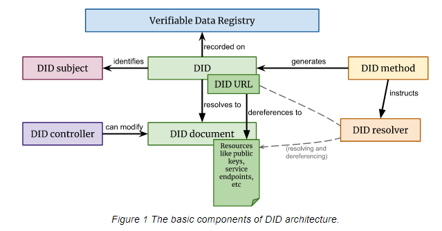

## Terminology

#### **DID** 
Decentralized Identifiers are stable identifiers which are bound to a controlling keypair, which is usually rotatable without changing the identifier. This is achieved by a publication mechanism maintaining information about key material in verifiable data stores (usually distributed ledgers) over time. This information is referred to as a DID Document. The [specification](https://www.w3.org/TR/did-core/) governing these identifiers is maintained by a dedicated W3C [working group](https://www.w3.org/2019/did-wg/), of which Spruce is a member. For more information on the W3C, see the **Further Reading** section.

Src: [DID specification](https://www.w3.org/TR/did-core/#architecture-overview)

#### DID Document
A record returned by a query for a DID, containing information on how to verify information linked in some way to that identifier. The name can be misleading, since in many cases this "document" is entirely ephemeral or contextual and not intended to be a static file or document stored or cached anywhere.  It is sometimes couched in a "Resolution object," which contains metadata about the query and resolution process, although most application developers have no need to worry about these DID mechanics. For a The [specification](https://w3c-ccg.github.io/did-resolution/) governing the DID-->Document resolution process is maintained by a dedicated W3C [working group](https://www.w3.org/2019/did-wg/), of which Spruce is a member. For more information on the W3C, see the **Further Reading** section.
#### DID Method
A set of interdependent governance, publication, and discovery mechanisms for DIDs in a given DID namespace, specified by a shared specification. This specification explains how to validate a DID (namespace rules), where to query and what to expect back when resolving a DID, etc. The [registry](https://w3c.github.io/did-spec-registries/#did-methods) of compliant specifications for DID Methods is maintained by a dedicated W3C [working group](https://www.w3.org/2019/did-wg/), of which Spruce is a member. For more information on the W3C, see the **Further Reading** section.
#### DID:Key
A special DID Method that generates conformant, offchain DID documents for local, private, and/or ephemeral resolution from a keypair. This can be helpful for integrating conventional PKI or signing infrastructure with DID issuance, or to allow caching or local resolution of DID documents where it is undesirable or impossible to resolve remote DIDs. The [specification](https://w3c-ccg.github.io/did-method-key/) for this method was originally created in, and maintained in, the [W3C-Credentials Community Group](https://w3c-ccg.github.io/).
  
## Further Reading

Further educational/contextual resources on decentralized identity topics can be found on the [Education page](https://identity.foundation/education/) of the Decentralized Identity Foundation.

For a good introduction to the Semantic Web and JSON-LD as a data format and as a novel approach to web engineering, see these articles by [Nader Helmy](https://medium.com/mattr-global/learn-concepts-semantic-web-250784d6a49f) and [Orie Steele](https://medium.com/transmute-techtalk/on-json-ld-and-the-semantics-of-identity-42d051d3ce14).